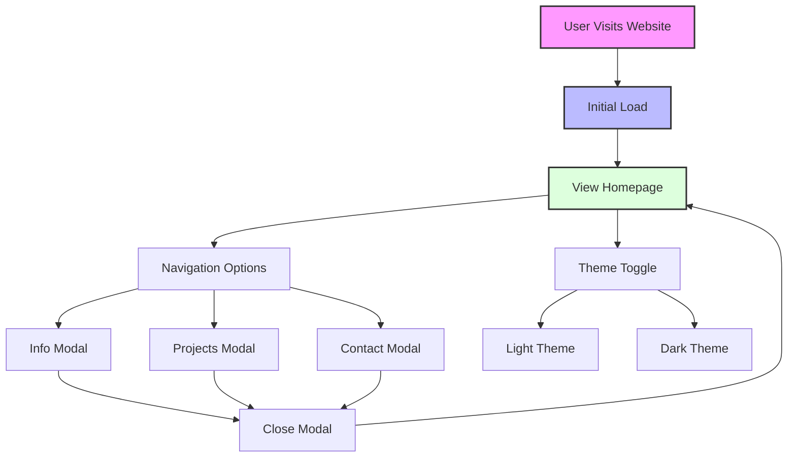

# PORTFOLIO PROJECT OUTLINE

## Basic Idea

## Features to be included

-Features Included

-Homepage: A central hub for navigation.

-Theme Toggle: Enhances user experience with light and dark theme options.

-Modal Windows: Provides additional information through separate sections:

-Info Modal

-Projects Modal

-Contact Modal

-Responsive Design: Ensures smooth navigation and usability across devices.

-Intuitive User Flow: Designed for seamless interactions and clear navigation paths.
